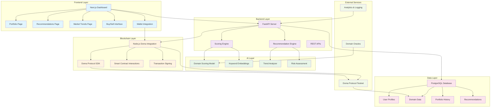
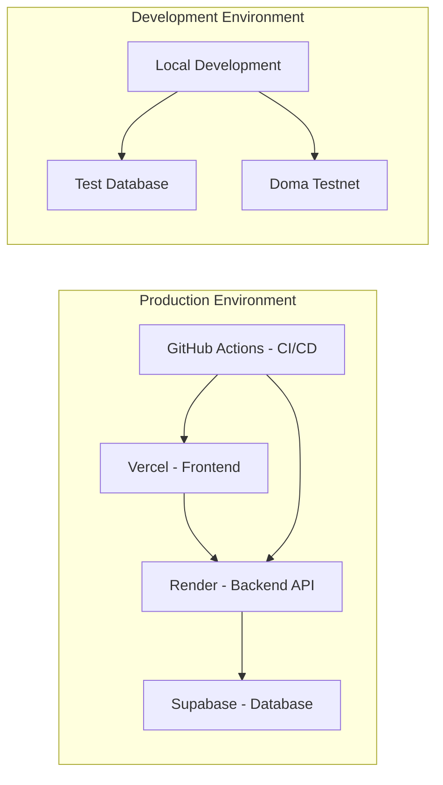

# AI-Driven Domain Investment Advisor - System Architecture

## 🏗️ System Overview



## 🔄 Data Flow

### 1. User Authentication Flow
```
Wallet Connect → Frontend → Backend → Database (User Profile)
```

### 2. Portfolio Analysis Flow
```
Frontend Request → Backend API → AI Scoring → Doma Protocol → Database → Response
```

### 3. Recommendation Flow
```
User Profile + Market Data → AI Engine → Risk Assessment → Personalized Recommendations
```

### 4. Trading Flow
```
Frontend Trade Request → Backend Validation → Doma Protocol → Smart Contract → Transaction
```

## 🏛️ Component Details

### Frontend (Next.js 15)
- **Portfolio Dashboard**: Real-time portfolio valuation and health scores
- **Recommendations Engine**: AI-driven buy/sell/hold suggestions
- **Market Trends**: Trending TLDs and keyword analysis
- **Trading Interface**: One-click domain transactions
- **Wallet Integration**: MetaMask/WalletConnect support

### Backend (FastAPI)
- **Scoring Engine**: Domain valuation using heuristics + AI
- **Recommendation Engine**: Personalized investment advice
- **REST APIs**: Clean endpoints for frontend consumption
- **Authentication**: Wallet-based user management

### AI Layer (Python)
- **Domain Scoring**: Rule-based + ML-based valuation
- **Keyword Embeddings**: NLP analysis of domain names
- **Trend Analysis**: Market movement prediction
- **Risk Assessment**: Portfolio risk evaluation

### Blockchain Integration (Node.js)
- **Doma Protocol SDK**: Domain metadata and trading
- **Smart Contract Interactions**: On-chain transactions
- **Transaction Signing**: Wallet integration
- **Event Monitoring**: Real-time blockchain updates

### Data Layer (PostgreSQL)
- **User Management**: Profiles, preferences, risk tolerance
- **Domain Database**: Metadata, valuations, trade history
- **Portfolio Tracking**: Holdings, performance, transactions
- **Recommendation History**: AI suggestions and outcomes

## 🚀 Deployment Architecture



## 📊 API Endpoints

### Core Endpoints
- `GET /api/score?domain=` - Domain valuation scoring
- `GET /api/trends` - Market trends and analysis
- `GET /api/recommendations?user_id=` - Personalized recommendations
- `POST /api/portfolio` - Portfolio management
- `POST /api/trade` - Execute domain trades

### Blockchain Endpoints
- `GET /api/doma/domain/{name}` - Domain metadata from Doma
- `POST /api/doma/buy` - Buy domain transaction
- `POST /api/doma/sell` - Sell domain transaction
- `GET /api/doma/trending` - Trending domains from Doma

## 🔒 Security Considerations

- **Wallet Authentication**: Sign-in with Ethereum
- **API Rate Limiting**: Prevent abuse
- **Input Validation**: Sanitize all user inputs
- **Transaction Signing**: User must sign all blockchain transactions
- **Data Encryption**: Sensitive data encryption at rest

## 📈 Scalability Features

- **Microservices Architecture**: Independent scaling of components
- **Caching Layer**: Redis for frequently accessed data
- **Load Balancing**: Multiple backend instances
- **Database Optimization**: Indexed queries and connection pooling
- **CDN**: Static asset delivery optimization
